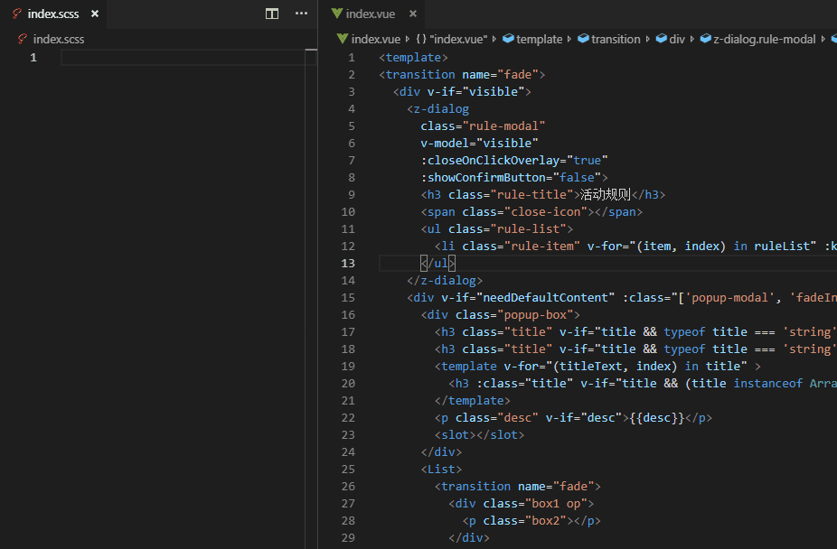

# AutoScssStruct4Vue

根据 `vue`文件的模板`template`结构，自动生成对应的 `scss`文件



## Features

- 识别 `vue`内置元素和组件标签
- 过滤同级重复的选择器
- 只在原先的基础上增加新的选择器规则，不删减

## Example

### example_1

```html
<template>
  <div class="box">
    <button id="btn"></button>
    <transition name='fade'>
      <p class="box2">
        <a class="box3"></a>
        <span></span>
      </p>
    </transition>
  </div>
</template>
```
扩展执行编译后：
```html
<template>
  <div class="box">
    <button id="btn"></button>
    <transition name='fade'>
      <p class="box2">
        <a class="box3"></a>
        <span></span>
      </p>
    </transition>
  </div>
</template>
<style lang="scss" scoped>
  .box {
    #btn {
    }
    .box2 {
      .box3 {
      }
      span {
      }
    }
  }
</style>
```

### example_2
```html
<template>
  <div class="box">
    <!-- 增加一个标签 -->
    <p :class="['desc', 'summary', dataClass]"></p>
    <button id="btn"></button>
    <transition name='fade'>
      <p class="box2">
        <a class="box3"></a>
        <span></span>
      </p>
    </transition>
  </div>
</template>
<style lang="scss" scoped>
  .box {
    #btn {
    }
    .box2 {
      height: 20px;
      width: 100px;
      .box3 {
      }
      span {
        color: #fff;
      }
    }
  }
</style>
```
扩展执行编译后：
```html
<template>
  <div class="box">
    <!-- 增加一个标签 -->
    <p :class="['desc', 'summary', dataClass]"></p>
    <button id="btn"></button>
    <transition name='fade'>
      <p class="box2">
        <a class="box3"></a>
        <span></span>
      </p>
    </transition>
  </div>
</template>
<style lang="scss" scoped>
  .box {
    // 增加新的选择器规则
    .desc {
    }
    .summary {
    }
    #btn {
    }
    .box2 {
      height: 20px;
      width: 100px;
      .box3 {
      }
      span {
        color: #fff;
      }
    }
  }
</style>
```

## 配置项(Settings)

### autoscssStruct4Vue.excuteMode

在什么情况下重新生成 `scss`文件，提供两种选择：

- 当使用 `autoscssStructWhenCommand` 命令时执行(`excute when command`)(**default**)

即使用 `vscode`命令：`ctrl+shift+p`，选中 `autoscssStructWhenCommand`命令时，扩展执行

或者在编辑器内，右键，选中菜单中的 `autoscssStructWhenCommand`时，扩展执行

- 当保存时，以及当使用 `autoscssStructWhenCommand` 命令时执行(`excute when save&command`)

在上一条的基础上，增加了当文件保存时，扩展执行

### autoscssStruct4Vue.scssFilePath

编译生成的 `scss`字符串写入的文件相对路径（相对于当前文件）

如果此配置项为空，则写入当前 `vue`文件的 `<style>`标签内（没有则自动创建），**默认为空(default)**

如果指定了此值并且不为空，则将编译生成后的 `scss`字符串写入指定路径的文件内（如果不存在则自动创建）

例如，对于 `/disk/project/index.vue` 这个路径的文件来说：

此值配置为 `../index.scss`（注意，因为 `vscode API`读取路径的格式问题，这里同级是两个点），则最后编译生成的 `scss`文件路径为 `/disk/project/index.scss`

此值配置为 `../../index.scss`，则最后编译生成的 `scss`文件路径为 `/disk/index.scss`

